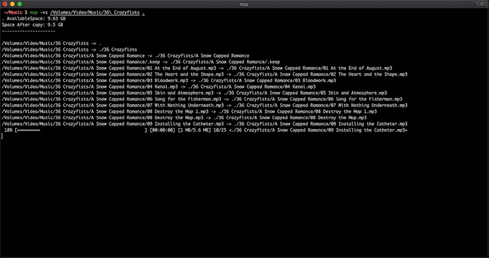
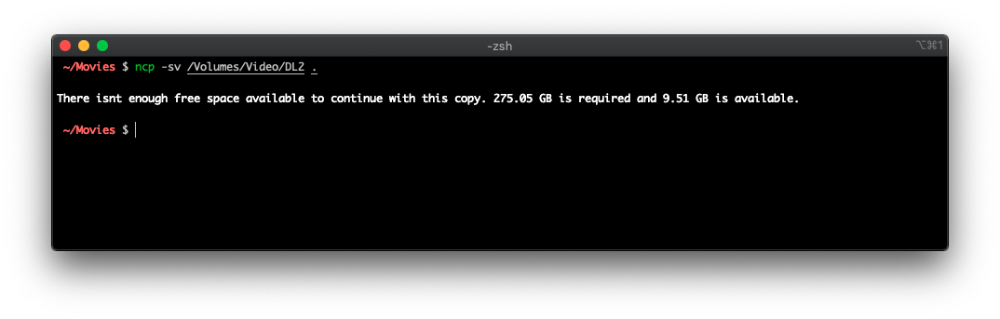
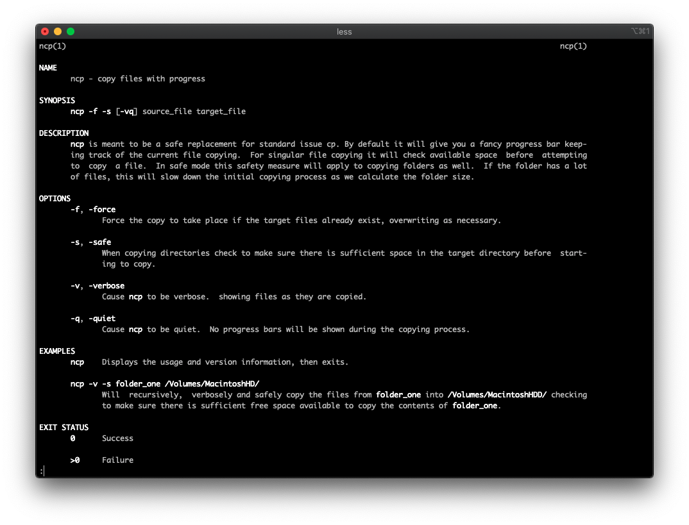

# ncp
**ncp** is meant to be a safe replacement for standard issue cp. By default it will give you a fancy progress bar keeping track of the current file copying. For singular file copying it will check available space before attempting to copy a file. In safe mode this safety measure will apply to copying folders as well. If the folder has a lot of files, this will slow down the initial copying process as we calculate the folder size. 

   
   
   
## Features

- [x] Copy files with descriptive progress
- [x] Safety features check available space before initiating a copy

## Requirements

- macOS 10.8+
- Xcode 11

## Installation

#### Manually

1. Change into the **ncp** folder
2. `./build.sh`

## Contribute

We would love you for the contribution to **ncp**, check the ``LICENSE`` file for more info.

## Future Plans

- Make the necessary code into a framework or library and add it to cocoapods
- Add any other feature disparities that exist in original **cp** and not in **ncp**
- Add a cask to brew for easier installs

## Meta

Kevin Bradley 

Distributed under the MIT license. See ``LICENSE`` for more information.

I was looking for a way to copy files with progress and since `NSFileManager` is woefully equipped for this I searched around and stumbled over [RSTLCopyOperation](https://github.com/rustle/RSTLCopyOperation) and found it to be the perfect foundation to create a new & better 'cp'.

[https://github.com/lechium/ncp](https://github.com/lechium/ncp)

[license-image]: https://img.shields.io/badge/License-MIT-blue.svg
[license-url]: LICENSE
